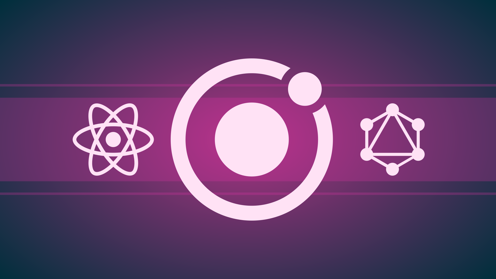

# Ionic, React, GraphQL & Apollo: Consumindo API da SpaceX

Repositório do curso [Ionic, React, GraphQL & Apollo: Consumindo API da SpaceX)](https://www.udemy.com/course/ionic-react-graphql/?couponCode=IONIC_REACT_GITHUB) disponível na Udemy.



## Aplicação em produção

O App que foi desenvolvido no curso consome a API GraphQL da SpaceX, e pode ser acessado por aqui: [https://spacex-app.now.sh/](https://spacex-app.now.sh/)

## Tecnologias

Tecnologias que foram usadas:

- Ionic (4.x)
- React (16.x)
- React Hooks
- React Router
- React Router DOM
- Ionic React Router
- CSS Modules
- GraphQL
- GraphQL Code Generator
- Apollo Boost
- Apollo React Hooks
- Apollo Cache InMemory
- Date FNS
- Typescript
- Prettier
- ESLint

* Outras ferramentas
  - Ionic CLI
  - Create React App
  - Swiper API
  - Apollo Devtools
  - React Devtools
  - Zeit Now (Cloud Provider)

## Conteúdo do curso

O curso mostra como criar e evoluir projetos usando a integração oficial do React com o Ionic, e também com GraphQL e Apollo React Hooks:

- Introdução
  - Estrutura do curso
  - Código fonte
  - Canais de interação
- Ferramentas
  - VSCode, extensões, tema e fonte
  - Node e NPM
  - Ionic e Cordova CLI
  - Apollo Devtools e React Devtools
- Primeiro App com Ionic React
  - O que é o Ionic
  - Novo projeto com Ionic CLI
  - Estrutura do projeto
  - Ionic Lab e DevApp
  - Prettier e ESLint
- Integrando React com GraphQL
  - O que é o GraphQL?
  - API da SpaceX
  - Apollo Boost e React Apollo Hooks
  - GraphQL Code Generator
  - Enviar primeira Query GraphQL
- Tema, Cards e Components: Listando missões da SpaceX
  - Temas
  - IonCard
  - Presentational e Smart Components
  - CSS Modules
- Infinite Scroll com Apollo React Hooks
  - Limit e Offset
  - useState e useEffect
  - Apollo React Hooks fetchMore
- Rotas e Navegação com Ionic, React e Router DOM
  - Rotas em arquivo separado
  - Ionic React Router (Router Link, Direction)
  - Extrair parâmetros da url
  - IonBackButton
- Criando uma galeria de imagens com Ionic
  - IonSlides e Swiper API
  - Modal e Recurso de Zoom
- Trabalhando com Menus
  - Como funcionam
  - Toggle
  - Menu da aplicação
- Grid e Split Pane com Ionic
  - Dimensão e posicionamento
  - Layout multi view
- Exibindo loading e tratando erros

  - IonLoading
  - Component isolado para exibir erros

- Deploy em produção
  - Build de produção
  - Now secrets (env vars)
  - Deploy

* Conclusão do curso

Veja a [grade completa na página do curso](https://www.udemy.com/course/ionic-react-graphql/?couponCode=IONIC_REACT_GITHUB).

## Teste localmente

Se quiser testar o projeto localmente basta seguir estes passos:

1. Instale o Ionic CLI globalmente:

```bash
npm i -g ionic
```

2. Clone o repositório usando HTTPS

```bash
git clone https://github.com/plinionaves/ionic-react-graphql.git
```

3. Acesse o diretório criado para o projeto

```bash
cd ionic-react-graphql
```

4. Instale as dependências do NPM:

```bash
npm i
```

5. Sirva localmente com o Ionic CLI:

```bash
ionic serve
```

Será aberta uma nova aba no browser com o endereço `http://localhost:8100`

## Contato

Desenvolvido por: [Plínio Naves](https://www.udemy.com/user/plinio-naves/)

- Email: [pliniopjn@hotmail.com](mailto:pliniopjn@hotmail.com)
- Twitter: [@plinionaves](https://twitter.com/plinionaves)
- Github: [github.com/plinionaves](https://github.com/plinionaves)
- Linkedin: [linkedin.com/in/plinionaves/](https://www.linkedin.com/in/plinionaves/)

Participe do nosso grupo no Facebook: [Cursos Plínio Naves](https://www.facebook.com/groups/200267383740594)
